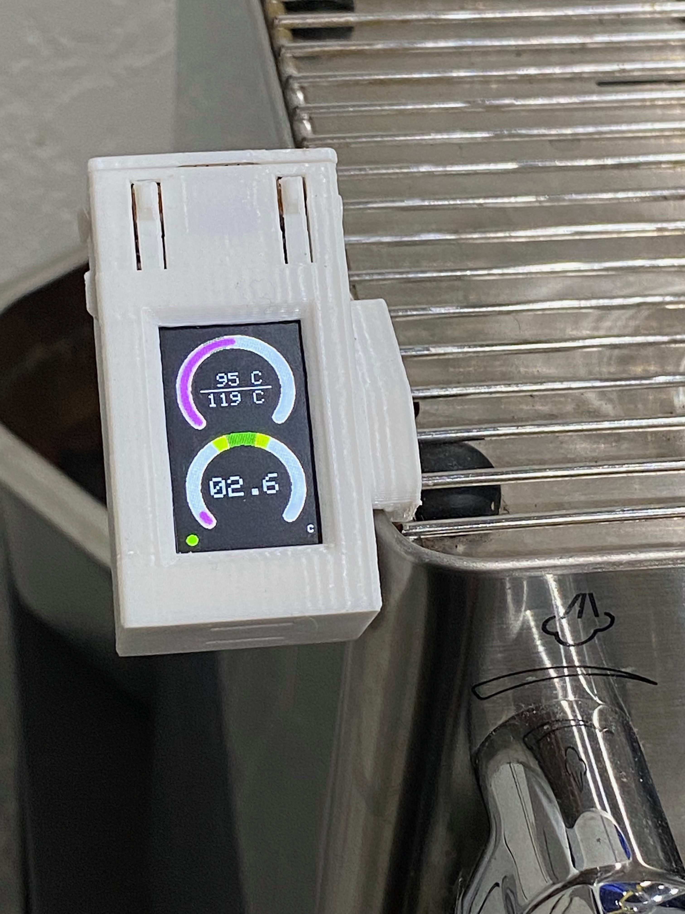

# Maralicious: A MaraX Display Mod

This is a work in progress display for the Lelit MaraX, primarily an automatic shot timer for the LilyGo T-Display. Still very much a work in progress but basic functionality is there.



## Current and to be done functionality:

- [x] Shot timer
- [x] Read serial port and display useful data (temperature, heater on or off, steam or brew mode)
- [x] Connect to wifi and dump serial output to wifi
- [ ] Polish display (purple dials probably isn't the best ux)
- [ ] Stretch goal: Serve webpage with relevant graphs about (if memory constraints allow)

## The journey and the hardware

I more or less started working on this immediately after getting my Mara. Maybe it would've been easier to buy a machine that already displays this data but this machine was too good a deal to not get and I like tinkering with things anyways.

It runs on a LilyGo T-Display for now, may upgrade to the T-Display S3 in the future, but this should work for basically any LilyGo product. A number of other Mara monitors on Github run the T-Display and this originally started with me just wanting to get one of those running before being dissatisfied and deciding to make my own. It's cheap, 10 bucks a pop, I liked them enough I bought a few extras for other shenanigans. Initially this was somewhat inspired by [benovic/mara_display](https://github.com/benovic/marax_display) but all of the code is written by me. 

The serial port is connected through some wires to the T-Display, [see here how to connect them](https://www.reddit.com/r/espresso/comments/hft5zv/data_visualisation_lelit_marax_mod/). Getting this working was somewhat trivial.

The bigger thing was figuring out how to mount the thing onto the Mara, I settled on figuring out how to get it just to clip onto the top of the Mara since it seemed very clippable, and thankfully I have a 3D printer and 9th grade CAD modeling skill. Since creating a case from scratch seemed like a pain I settled on taking an existing case and modifying it in Fusion to clip and have an inlet for wires, resulting in the files inside ```cad```. This was surprisingly successful, although modifying an STL was a bit of a pain, and getting wires to feed into the case is also not easy, but it works and looks pretty. It took a few iterations to get it to clip as close as possible to the front, where there's a hole in the machine for the wires to enter into.


With the case done, I needed to get the pump switch figured out. The timer checks when the pump is running, this took a while to figure out and a few different approaches were tried. First I tried placing a reed switch on the pump, reed switches trigger when in presence of a magnetic field and the pump generates one when on, however connection was very intermittent and didn't work well and the reed switches were super fragile. Figuring out how to place the switch on the pump was also a big pain. 

Second I tried wiring up to the mara switch itself, the switch which actually triggers the pump is a 2 way switch, running 5 volts from the controller back to the controller when the pump needs to run. I tried using an octocoupler to detect when it runs, however this failed as apparently the current flowing through for this signal wire is in the microamps, less than the 1 milliamp needed to trigger the octocoupler. I also tried wiring up to the switch directly, there was a 3rd unused pin on the switch inside connecting the common to it when the switch was off, I was able to get this to work but I was very worried about cross circuit interference/contamination, I had to tie the arduino's ground to the Mara's ground and even then dumping to ground isn't the best idea. I ordered new reed switches thinking those old ones were a fluke and tried again.


The new reed switches also didn't work, but it didn't take me too much debugging to figure out how to solve the problem: **if its an intermittent signal, smooth it out with a capacitor.** I tied a small microfarad capacitor across the reed switch and it was able to fix the signal, it didn't even need any debouncing surprisingly. 

The last thing I needed was power. I ran a risky experiment, the serial port on the mara does supply 5 volts, however it doesn't provide enough current to be able to run the arduino. So instead I just rigged up a 5 volt power brick on the inside, I took an old phone charger, manually soldered the mains to the mains on the mara power button (after figuring out which was the source and which the output), and just hooked up a power brick on the inside. I tried to keep it away from most of the hot parts, and taped what I could to waterproof it a bit. But it got me working power, I was able to solder a custom USB cable of the right length ending in the battery connector for the T-Display.

A bit of code later, I had a working product!

In summary

### Hardware used

* Lelit Mara X 
  * The current code should mostly work for the Mara X V2, however the V2 dumps whether the pump is on or not to the serial port, meaning you do not need the reed switch at all. The code currently does not support this but can be relatively easily modified to do so. 
* LilyGo T-Display
* Reed switch
* Wires with dupont connectors
* 1 microfarad capacitor


## How to run

Assuming you have the arduino ide setup or the VSCode extension for arduino setup, and have the esp32 board module also installed for either of these.

Necessary dependencies are

* Button2 (currently not really used but its included in the code for now until I use it or delete it)
* TFT_eSPI
* WiFi

All should either come with the esp32 board module or can be downloaded from the arduino library manager.


#### IMPORTANT: Setup TFT_eSPI

Within the library folder there should be a file titled "User_Setup_Select.h." You must uncomment the T-Display line (currently Setup25) and **COMMENT #include <User_Setup.h> **. I wasted hours wondering why a quarter of my display was static because I forgot to comment this out. 

If you have some other board supported by TFT_eSPI, the code I've written may work if you enable it but no guarantees, you run everything here at your own risk. 

Beside that, configure the necessary parameters in ```src/config```. The files aren't too hard to read so just give them a scroll through. Compile, upload to your board, and enjoy.


**DO NOT RUN IF YOU DO NOT KNOW WHAT YOU ARE DOING, I TAKE NO RESPONSIBILITY FOR ANY DAMAGE TO YOUR MARA OR ANYTHING ELSE, USE AT YOUR OWN RISK**